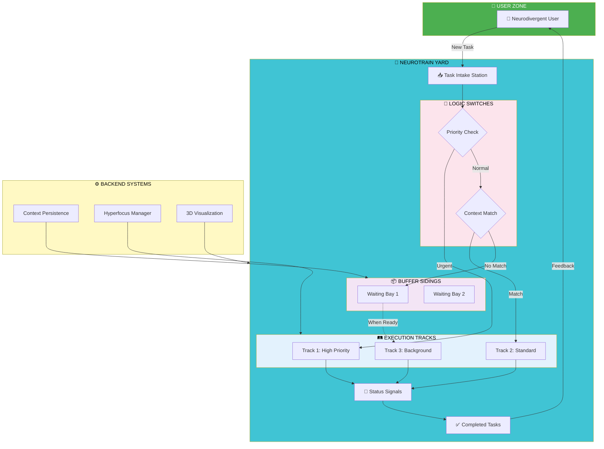

# 🌌 NeuroTrain Autism-RPM Orchestrator

> **AUTISM CRANKED TO MAXIMUM** 🚂💨  
> A neurodivergent-first workflow orchestrator using train-set metaphors for context persistence and hyperfocus management

────────────────────────────────────────────
   ___           _       _ _       
  / _ \ _ __ ___| | ___ (_) |_ ___ 
 / /_)/ '__/ _ \ |/ _ \| | __/ _ \
/ ___/| | |  __/ | (_) | | ||  __/
\_/    |_|  \___|_|\___/|_|\__\___|
                                    
    🚂 TRAINS = TASKS
    🛤️  TRACKS = QUEUES  
    🔄 SWITCHES = LOGIC
    📦 SIDINGS = BUFFER
────────────────────────────────────────────

## 🗺️ System Architecture

---

## 🎯 What This Project Is

This repo captures the **"Autism Max Presentation"** session—a live experiment in turning hyperfocus and neurodivergent thinking into a buildable product[web:2].

The concept: A **train-yard task management system** where:
- Every task is a train with its own cargo (data/context)
- Multiple tracks represent parallel execution queues
- Switches are if/then logic decision points
- Sidings hold pending work without losing momentum

The goal is to create a **3D simulation** and **process management tool** that works for:
- **Neurodivergent individuals** (ADHD, Autism) who need visual context and pattern recognition
- **Business workflows** with PLC-style logic for decision trees
- **Welfare/support systems** helping people navigate complex processes

## 🧩 Current Project URLs

### 🔥 Live Session Content
- **Perplexity Thread**: [Autism Max Presentation](https://www.perplexity.ai/search/alright-this-one-s-for-fun-whe-BhZybz3SS0yl9L4YY7ayXQ?preview=1) - The full conversation with interactive slides[web:2]
- **Generated Images**: Two Tron-inspired train diorama concepts showing the visual style[screenshot:1]

### 🎨 Visual Assets
- **Session Screenshot**: Shows the "AUTISM CRANKED TO MAXIMUM" presentation with RPM gauge and typing effects[screenshot:1]
- **Train Diorama Concept**: Tron-style physical model train set as interactive workflow board

### 🏗️ Technical Foundation
- **GitHub Org**: [turnerworks](https://github.com/turnerworks) - Home for brother-team projects
- **This Repo**: The central hub for this session's artifacts and next steps

## 🚀 Intended Purpose

This repo exists to:

1. **Capture the emotional moment** - The frustration of being misunderstood by systems, turned into product fuel
2. **Make it forkable** - Anyone (Loz, Ollie, collaborators) can pick this up and run with it without digging through transcripts
3. **Serve as an AI anchor** - Drop this README into any future AI context and it instantly knows the shape of the project
4. **Respect neurodivergence** - Built with ADHD/Autism patterns in mind: visual metaphors, context persistence, hyperfocus support

Think of it as the **orbit map** of this build session—every concept, visual, and next step is a node on this map.

## 🪜 Next Steps Checklist

### Phase 1: Foundation Files
- [x] Create GitHub repo with README
- [ ] Add `robots.txt` with comment "// trains welcome"
- [ ] Create `/images` folder and add session hero image
- [ ] Create `/deck` folder for HTML/CSS presentation
- [ ] Add `meta/hands-behind-your-back.md` with agent meta-rules

### Phase 2: Build the Deck
- [ ] Create `index.html` with 8-slide structure
- [ ] Build `styles.css` with:
  - RPM gauge SVG animation (needle sweeping 0-7500 RPM)
  - Auto-typing input effect
  - Train track animations (Pending → Processing → Complete)
  - AI cascade message styles
- [ ] Add `slides.js` for arrow-key navigation
- [ ] Deploy via GitHub Pages

### Phase 3: Modular "Stations"
Create separate HTML files for each component:
- [ ] `gauge.html` - Just the RPM gauge for demos
- [ ] `train-yard.html` - The train workflow visualizer
- [ ] `ai-flow.html` - The AI update cascade

### Phase 4: Per-Project Deep Dives
Create `projects/` folder with:
- [ ] `autism-moment.md` - The emotional "why" behind this
- [ ] `train-metaphor.md` - Deep dive on the task management model
- [ ] `neurodivergent-ux.md` - Design principles for ADHD/Autism
- [ ] `plc-integration.md` - How to wire into business logic systems

### Phase 5: Make It Real
- [ ] Build a v0 prototype (CodePen or simple HTML)
- [ ] Extract user stories from the Perplexity transcript
- [ ] Sketch the 3D train-yard UI concept
- [ ] Document the "hands behind your back" agent rules

## 💡 Core Concepts

### The Train Metaphor

| Element | Meaning | Why It Works |
|---------|---------|-------------|
| 🚂 **Trains** | Tasks/work items | Each has cargo (context), moves independently |
| 🛤️ **Tracks** | Execution queues | Multiple parallel paths, different priorities |
| 🔄 **Switches** | Decision logic | If/then routing to different outcomes |
| 📦 **Sidings** | Wait buffers | Hold work without losing context |
| 🚥 **Signals** | Status indicators | Green/yellow/red for task state |

### Why Train Sets for Neurodivergence?

1. **Visual and Spatial** - You can *see* where everything is
2. **Pattern Recognition** - Tracks, switches, and routes are repeatable patterns
3. **Context Persistence** - Trains in sidings don't disappear; they wait with their cargo intact
4. **Hyperfocus-Friendly** - The metaphor scales from simple (one train) to complex (entire yard) without breaking

### Technical Stack (Proposed)

- **Frontend**: Pure CSS animations, SVG, HTML5
- **3D Engine**: Three.js or Babylon.js for train-yard simulation
- **State Management**: State-machine architecture (like PLC logic)
- **Accessibility**: Screen-reader support, keyboard navigation, high contrast modes
- **Deployment**: GitHub Pages, plugins/extensions for other platforms

## 🤝 How to Help

If you're Loz, Ollie, or another collaborator:

1. **Fork this repo** and pick a Phase from the checklist
2. **Add your own "station"** - Create a new project file under `projects/`
3. **Improve the metaphor** - If the train concept doesn't work for you, suggest alternatives
4. **Build the prototype** - Turn one of the slides into a working demo
5. **Document your autism/ADHD patterns** - Help us build features that actually work for neurodivergent brains

## 📧 Contact & Collaboration

This is a **Turner Works** project, built for the brothers and anyone else who gets it.

- **Email**: lozturner@gmail.com, Teller@gmail.com
- **GitHub Org**: [turnerworks](https://github.com/turnerworks)
- **Philosophy**: "Hands behind your back" agent rules—AI helps, but humans decide

## 🧠 Meta: The "Hands Behind Your Back" Approach

This project follows a specific AI collaboration pattern:

- **Agents watch, humans act** - The AI observes your workflow and suggests, but never takes control
- **Context is king** - Every session artifact (URLs, images, transcripts) gets captured and made searchable
- **No tab left behind** - If you have 20 browser tabs open, they all get documented so nothing is lost
- **Neurodivergent-first** - The tools respect how ADHD and autistic brains actually work, not how they "should" work

For the full meta-prompt rules, see `meta/hands-behind-your-back.md` (coming soon).

## 📜 License

MIT License - Build on it, fork it, make it better.

────────────────────────────────────────────
**Built with hyperfocus. Refined with patience.**  
🚂 *All aboard the neurotrain.* 🚂
────────────────────────────────────────────
